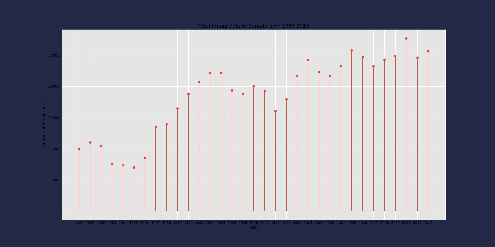

# Data_Visualizations_Python
A Look into various data visualizations using popular python libraries

Data Visualization refers to visually presenting data through graphs, charts, maps, and dashboards to facilitate comprehension of trends, outliers, and patterns. The effectiveness of conveying information through data visualization hinges on our creativity and ability to establish a communicative connection between the audience and the data being represented.

Steps Involved in our Visualization
1. Importing packages - primary packages include Pandas for Data processing, Matplotlib for visuals, Seaborn for advanced visuals, and Numpy for scientific calculations
2. Importing and Cleaning Data
3. Creating beautiful Visualizations (12 Types of Visuals)

## Dataset

I will be using a Kaggle dataset on Immigration to Canada from 1980–2013. [Dataset Link](https://www.kaggle.com/datasets/ammaraahmad/immigration-to-canada). This dataset consists of immigrants record from 150+ countries to Canada between 1980 to 2013.

## Some plots covered in this project

Simple Area chart in Cyberpunk style

Doughnut chart

Strong regression trend graph

Lollipop graph

Multiple Lines chart